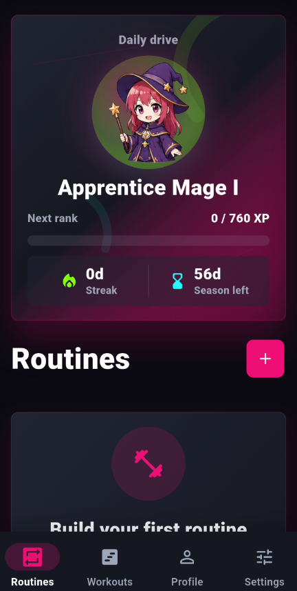
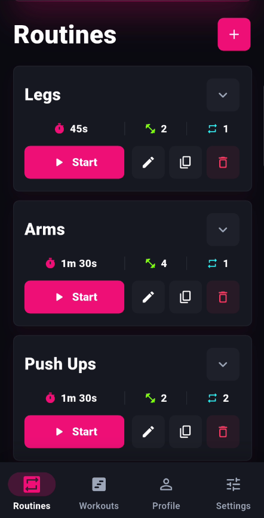
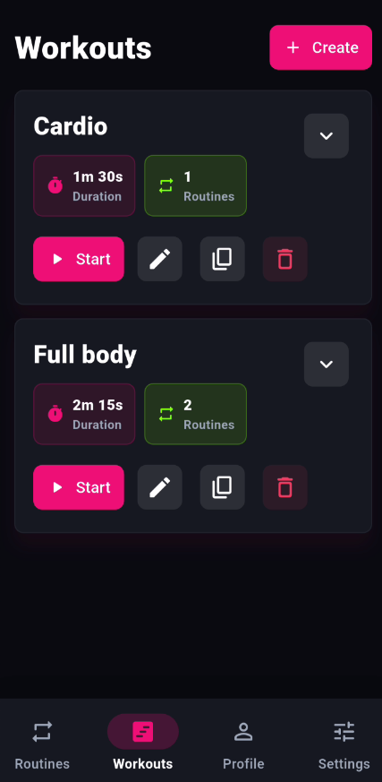
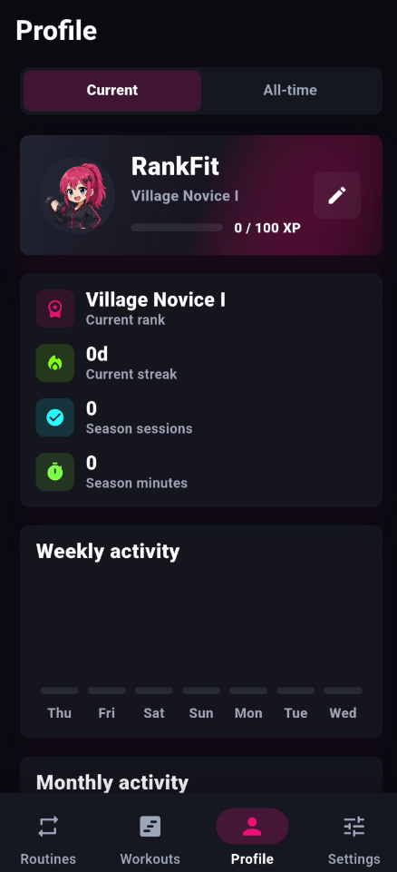

# RankFit

  

  <h3>Train. Rank up. Stay consistent.</h3>

  

    RankFit is an Android workout timer that turns routines into rank progression,
    XP, streaks, seasons, and unlockable fantasy rank characters.
  

  

    
    
    
    
  

## Overview

RankFit helps you build timed exercise routines, combine them into workouts, and stay motivated through lightweight game progression. Complete routines to earn XP, grow your streak, move through 60-day seasons, and unlock fantasy rank characters.

## Screenshots

  
  
  
  

## Features

- Build timed routines with exercises, rests, repetitions, and rounds.
- Chain routines together into full workouts.
- Earn XP from completed routines.
- Climb through 16 ranks with fantasy character artwork.
- Unlock rank characters as profile avatars.
- Track streaks, minutes, sessions, and activity trends.
- Customize your profile and app theme.
- Works locally on-device with no account required.
- Install directly on Android with an APK.

## Download

**Latest APK:** [Download RankFit from GitHub Releases](https://github.com/Johnkoder/rankfit-official/releases/latest)

**Current beta:** [RankFit v0.1.0 Beta 4](https://github.com/Johnkoder/rankfit-official/releases/tag/v0.1.0-beta.4)

## Install on Android

1. Download the APK from the latest release.
2. Open the APK on your Android phone.
3. If Android asks, allow installs from your browser or file manager.
4. Follow the installer prompts.
5. Open RankFit and start training.

> This APK is installed outside the Play Store. Android may show a warning. Only install it if you trust the source.

> Current beta builds are release-signed APKs intended for direct Android installation.

## Status

RankFit is currently in beta. Features, UI, and release packaging may change as the app improves.

## Source Code

This public repository is used for official RankFit releases and downloads. The app source code is not included in this repository.
